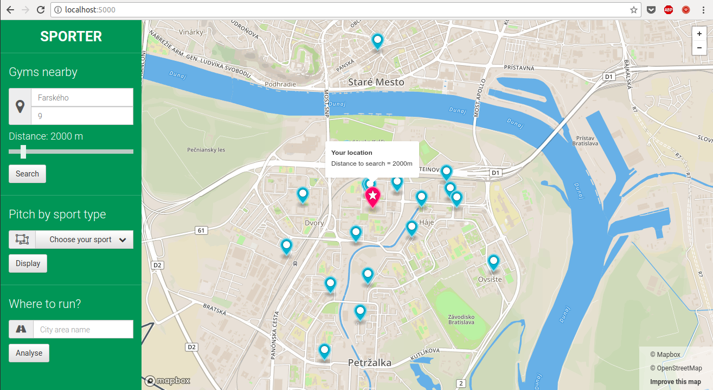
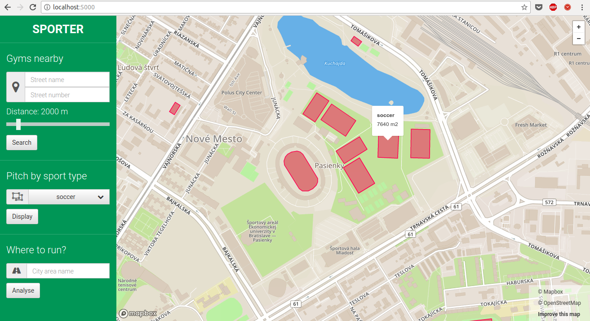
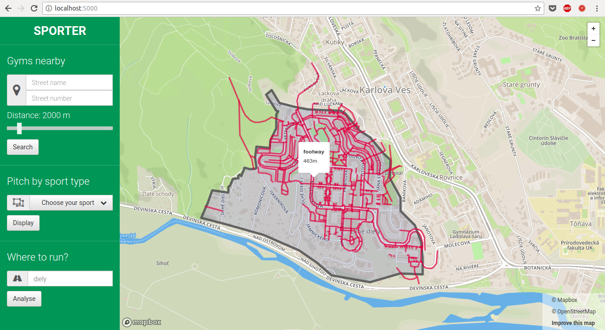

# Overview

Táto aplikácia zobrazuje body a oblasti z domény športu, podľa preferencií používateľa.

Hlavná funkcionalita:
* vyhľadávanie fitness centier a posilňovní do určitej vzdialenosti od zvolenej adresy:

* vyhľadávanie športovísk podľa typu:

* analýza vhodnosti pre beh, v ľubovoľnej časti mesta podľa jej názvu (fulltextovo):


Aplikácia má dve separátne časti, [frontend](#frontend) na strane klienta v podobe webu, 
s využitím javascriptu, mapbox API, google maps API a knižnice mapbox.js; 
a [backend](#backend) na strane servera, ktorý je napísaný v Pythone a využíva PostGIS databázu s OSM dátami mesta Bratislava.
Frontend a backend komunikujú prostredníctvom REST API.

# Frontend
Frontendová časť je implementovaná ako HTML webová stránka (`index.html`), ktorá zobrazuje mapu a ovládanie.
Pre zobrazenie mapy bola použitá pre lepšiu prehľadnosť a jednoduchosť téma `streets`. Farebné zobrazovanie bodov, polygónov a čiar, bolo prispôsobené
pre lepšiu viditeľnosť a rozlíšiteľnosť vizualizovaných dát.

V `appliacation.js` sú implementované volania na REST API a zobrazovanie dopytovaných dát na strane klienta.
Medzi hlavné funkcionality patrí:
- predvyplnenie dropdown listu pre jednotlivé typy športovísk,
- odoslanie údajov z vyplnených formulárov v rámci argumentov volaní na REST API,
- vytváranie vrstiev použitím `mapbox.js` a ich napĺňanie navrátenými dátami vo forme geojsonov.

# Backend

Backend je napísaný v `Pythone` s použitím microframeworku `Flask` a databázového adaptéra
`psycopg2` pre `PostgreSQL`. V module `app.py` sú implementované:
- REST API, 
- geocoding použitím Google Maps API
- dopytovanie do databázy.

O vytváranie spojenia s databázou sa stará modul `database.py`.

## Data
Dáta boli stiahnuté cez Open Street Maps, pokrývajú celú Bratislavu a jej blízke okolie.
Importovanie prebehlo použitím `osm2pgsql` s povoleným `hstore`. Okrem toho bolo použité
rozšírenie [`pg_trgm`](https://www.postgresql.org/docs/9.6/static/pgtrgm.html), pre zoradenie
výsledkov fulltextového vyhľadávania pomocou *vzdialenosti* výsledkov od pôvodného dopytu. 
Pre fulltextové vyhľadávanie bola vytvorená konfigurácia `sk` založená na `simple`.
Boli vytvorené nasledovné indexy:
- BTree indexy  na `amenity`, `leisure`, `name`, `sport` v tabuľke `planet_osm_polygon`,
- BTree indexy  na `amenity`, `leisure` v tabuľke `planet_osm_point`,
- BTree index  na `highway` v tabuľke `planet_osm_line`,
- gin index na `name` v tabuľke `planet_osm_polygon` pre fulltextové vyhľadávanie použitím `sk` konfigurácie,
- [trigram](https://about.gitlab.com/2016/03/18/fast-search-using-postgresql-trigram-indexes/) gin index rozšírenia `pg_trgm` na `name` v tabuľke `planet_osm_polygon` pre urýchlenie dopytovania typu `LIKE / ILIKE '%dopyt%'` (takýto druh dopytov v projekte nakoniec nebol použitý).

Všetky dopyty sú implementované v module `app.py`.

## Api
 Na strane servera je implementovaná REST API, ktorej základ
tvorí URI `/api/v1.0/` a jednotlivé kľúčové endpointy sú:

**Vyhľadanie fitness centier do určitej vzdialenosti od zvolenej adresy**

`GET /gym?dist=2000&streetName=Farskeho&streetNumber=9`

**Vyhľadanie všetkých športovísk podľa zvoleného typu**

`GET /pitch?sportType=soccer`

**Analýza vhodnosti pre beh vo zvolenej časti mesta**

`GET /cityAreaRunning?areaName=dlhe`

### Response
GeoJSON sa formuje pri samotnom dopytovaní v `app.py` použitím `psql` funkcie `json_build_object` a klientovi je vracaný vo formáte,
aký sa vyžaduje.

Príklad GeoJSON štruktúry pre bod, ktorý predstavuje fitness centrum:
```
{
  "geometry": {
    "coordinates": [
      17.1006278095105, 
      48.1276091029352
    ], 
    "type": "Point"
  }, 
  "properties": {
    "description": "fitness_centre", 
    "marker-color": "#3bb2d0", 
    "marker-size": "medium", 
    "marker-symbol": "circle", 
    "title": "Arena's Gym"
  }, 
  "type": "Feature"
}, 
```

Pri zobrazovaní čiar a polygónov je štruktúra analogická, menia sa len časti `properties` a `type`, 
podľa toho aká geometria sa zobrazuje.

### PostGIS
Pri dopytovaní do PostGIS databázy v `app.py` boli využité nasledovné funkcie:
- ST_Area
- ST_Dwithin
- ST_Length
- ST_Intersects
- ST_Centroid
- ST_Transform
- ST_AsGeoJSON
- ST_GeogFromText

### Dependencies
Serverovú časť v Pythone je možné rozbehať vytvorením [`conda virtual enviromentu`](https://conda.io/docs/user-guide/tasks/manage-environments.html) zo súboru `bratislava_gis.yml`, ktorý v sebe zahŕňa všetky závislosti.
Aplikáciu je následne možné spustiť príkazom `python app.py` z pracovného adresára, pričom pobeží na `localhost:5000`.